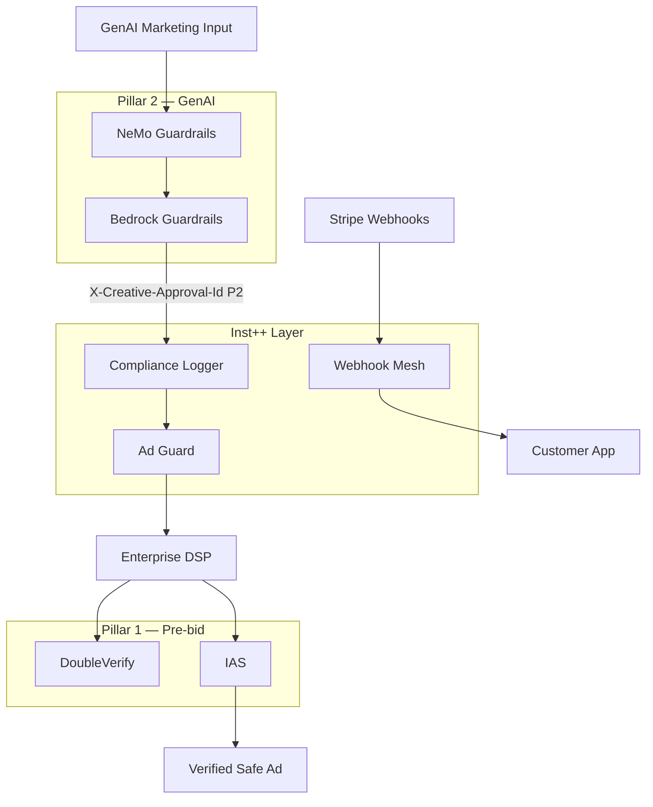

# Inst++ — Institutional Enterprise Stack Map

**Audience:** Enterprise procurement, holding-company programmatic ops, financial-institution marketing compliance.  
**Purpose:** Position Inst++ inside the same architecture tier as DoubleVerify, IAS, NeMo, and Bedrock — with honest boundaries.

---

## The two enterprise pillars (industry standard)

Large enterprises split ad guardrails into **two pillars**. Neither pillar alone covers the full risk surface:

| Pillar | Job | Typical incumbents | Latency bar |
|--------|-----|-------------------|-------------|
| **1. Pre-bid programmatic verification** | Block unsafe placements & fraud **before** auction | DoubleVerify, IAS, Oracle Moat | **Sub-millisecond** (DSP-integrated) |
| **2. GenAI infrastructure guardrails** | Block toxic creative, PII leakage, prompt injection | NeMo, Llama Guard, Guardrails AI, Bedrock | **~10–100ms** inference |

Inst++ does **not** replace either pillar. It fills the **gap between them**: compliance-grade audit + outbound spend control on marketing APIs.

---

## Pillar 1 — Pre-bid media verification (reference)

### DoubleVerify Enterprise
- Custom brand suitability profiles, real-time pre-bid filtering, fraud protection
- **DV Authentic Ad** — contractual baseline for enterprise media buys
- Processes trillions of programmatic data points; DSP-native integration

### Integral Ad Science (IAS) Total Media Quality
- Deep ML: frame-by-frame video, context-level sentiment, safety tiers
- Open web + social + programmatic enforcement

### Oracle Moat (legacy / independent enterprise)
- Viewability, attention metrics, invalid traffic (IVT) at massive scale
- Historical trust with financial institutions on data-scale verification

**Inst++ boundary:** No sub-ms RTB insert. No placement suitability NLP. **Complement only** — audit API-layer spend and mutations DV/IAS never see.

---

## Pillar 2 — GenAI creative guardrails (reference)

| Platform | Strength | Inst++ boundary |
|----------|----------|-----------------|
| **NVIDIA NeMo Guardrails** | Open-source programmable LLM rails | Inst++ runs **after** creative approval |
| **Llama Guard (Meta)** | Real-time input/output safety classifier | Creative safety ≠ spend safety |
| **Guardrails AI Hub** | Typed validators on OpenAI / Anthropic | Schema/tone ≠ bid velocity |
| **Amazon Bedrock Guardrails** | Managed cross-model PII + keyword filters | PII block ≠ campaign spend anomaly |

**Inst++ boundary:** No LLM inference. No prompt-injection model. Accept upstream `X-Creative-Approval-Id` (P2) from NeMo/Bedrock — do not rebuild their stack.

---

## What makes a guardrail system "institutional-grade"?

| Capability | Mid-market tools | Institutional incumbents (DV / IAS / NeMo) | **Inst++ (honest)** |
|------------|------------------|--------------------------------------------|---------------------|
| **Latency** | Async / minutes after event | Sub-ms pre-bid **or** real-time LLM | **<10ms** API proxy (memory gates) — **not** sub-ms RTB |
| **SLA & uptime** | 99% web hosting | 99.999% + financial penalties | **Buyer-operated** VPC/on-prem — SLA is deployer's |
| **Data privacy** | Shared cloud / scraping | Enterprise contracts, zero-retention options | **Air-gapped** — WAL/ledger local, no vendor cloud |
| **Compliance proof** | CSV dashboard downloads | SOC 2 Type II, ISO 27001, contractual metrics | **Cryptographic audit trail** — genesis chain + deterministic export |
| **Customisation** | Keyword blocklists | Custom-trained NLP / legal playbooks | **Per-campaign Z-score + token bucket** — math, not NLP |

**Inst++ wins on:** tamper-evident audit export, spend velocity kill, air-gapped deploy, deterministic repro-check.  
**Inst++ loses on:** pre-bid placement NLP, LLM safety inference, SOC 2 certification (packaging, not code).

---

## How institutions architect the nested firewall

Institutional architecture is **nested firewalls**, not a single dashboard:

```
[ GenAI Marketing Input ]
              │
              ▼
┌─────────────────────────┐
│   LLM SAFETY FIREWALL   │  NeMo / Llama Guard / Guardrails AI / Bedrock
│                         │  ► Blocks prompt injection & brand violations
└────────────┬────────────┘
             │ (Approved Copy / Asset)
             ▼
┌─────────────────────────┐
│   COMPLIANCE & LEGAL    │  ◄── Inst++ Compliance Logger (#1)
│                         │      Decision audit, F1–F9 gates, export bundle
│   + SPEND CONTROL       │  ◄── Inst++ Ad Guard (#6)
│                         │      Z-score spend drift, per-campaign bucket
└────────────┬────────────┘
             │ (Locked Assets + spend-approved)
             ▼
┌─────────────────────────┐
│     ENTERPRISE DSP      │  Integrates DoubleVerify / IAS pre-bid
└────────────┬────────────┘
             │ (Sub-millisecond placement auction)
             ▼
    [ Verified Safe Ad ]
```

### Parallel path — inbound billing / webhooks (fintech & SaaS)

Not in the ad diagram above, but institutional buyers also need:

```
[ Stripe / Shopify / billing provider ]
              ▼
┌─────────────────────────┐
│  WEBHOOK IDEMPOTENCY    │  ◄── Inst++ Webhook Mesh (#5)
│  MESH                   │      HMAC → CAS → WAL → durable forward
└────────────┬────────────┘
             ▼
    [ Customer application ]
```

---

## Inst++ product → firewall layer map

| Inst++ product | Firewall layer | Replaces incumbent? | Advertise to |
|----------------|----------------|----------------------|--------------|
| **#1 Compliance Logger** | Compliance & Legal (audit) | Partial — replaces CSV logs | Legal, risk, NGB governance |
| **#2 Proxy-Risk Gateway** | Outbound API risk (generic) | No — broker/fintech niche | Quant, fintech ops |
| **#3 Alt-Data Extractor** | Data ingestion (supporting) | No | Data engineering |
| **#4 AI Kit** | Agent limits (supporting) | No — not NeMo | AI product teams |
| **#5 Webhook Mesh** | Inbound reliability + audit | No — complements billing stack | SaaS, fintech, platforms |
| **#6 Ad Guard** | Compliance & Legal (spend) | No — complements DV/IAS | Agency, holding co, marketing finance |
| **#7 Health Telemetry** | Regulated ingest (future) | No | Enterprise health (hard GTM) |

---

## Enterprise sales narrative (copy-ready)

### For CMO / Head of Programmatic

> "DoubleVerify and IAS protect **where** your ad runs. NeMo and Bedrock protect **what** your creative says. Inst++ Ad Guard protects **how much** leaves your account — with a cryptographic audit trail procurement can actually replay. We sit between your approved creative and your DSP APIs, not inside the auction."

### For CISO / Legal / Risk

> "Inst++ Compliance Logger and Ad Guard produce **deterministic audit bundles** — genesis-anchored hash chains, not CSV exports. Deploy air-gapped in your VPC. We are the evidence layer for governance; we are not a replacement for your SOC 2-certified verification vendors."

### For procurement (RFP deflection)

| RFP asks for | Inst++ answer |
|--------------|---------------|
| Sub-ms pre-bid filtering | **No** — refer to DV/IAS; offer audit complement |
| LLM content safety | **No** — refer to NeMo/Bedrock; offer spend layer downstream |
| Webhook double-billing protection | **Yes** — Webhook Mesh (#5) |
| Marketing API spend anomaly kill | **Yes** — Ad Guard (#6) |
| Tamper-proof decision audit | **Yes** — Compliance Logger (#1) |

---

## Integration playbook (partner, don't compete)



**Phase 1 (now):** Deploy Ad Guard + Compliance Logger standalone.  
**Phase 2:** Wire `X-Creative-Approval-Id` from NeMo/Bedrock output manifest.  
**Phase 3:** Feed Ad Guard audit events into enterprise SIEM — export bundle is already deterministic.

---

## Demo commands (advertise-ready)

See `docs/INST_PLUS_TEST_AND_DEMO.md`. Smoke test:

```bash
./scripts/instpp_smoke_test.sh
ad-guard serve --port 8788
webhook-mesh serve --port 8787
```

---

## Explicit non-goals (never pitch these)

1. **Sub-5ms RTB exchange insertion** — Go/Rust; different company
2. **Brand suitability NLP** — DV/IAS domain
3. **LLM inference / prompt firewall** — NeMo/Bedrock domain
4. **SOC 2 Type II certification** — sell audit **spine**; buyer or consultant certifies ops
5. **Single mega-dashboard** — nested firewalls; one product per layer

---

## Related docs

- `docs/AD_GUARD_INSTITUTIONAL_STACK.md` — Product #6 deep dive
- `docs/INST_PLUS_DILIGENCE_PACK.md` — portfolio strategy
- `docs/INST_PLUS_TEST_AND_DEMO.md` — test & advertise playbook
