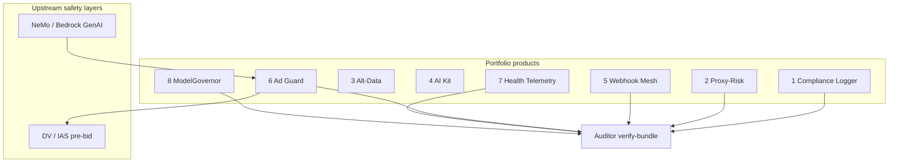

# Institutional Deep Dive — All 8 Products

**Audience:** Technical buyers, auditors, procurement, enterprise architects  
**Standard:** Institutional gold standard — fail-closed, offline verify-bundle, F1–F9 gates, typed errors, one-command demo  
**Spine:** `inst_spine` — genesis WAL, Lamport clocks, deterministic export, Redis fail-closed backends  
**Proof:** `./scripts/instpp_smoke_test.sh` · `./scripts/instpp_rigorous_test.sh` (all 8 products) · per-product `demo_*.sh`

---

## Institutional grade definition

| Dimension | Institutional requirement |
|-----------|----------------------------|
| **Correctness** | Fail-closed; no silent drops; every gate outcome logged where applicable |
| **Proof** | `export` → deterministic tar + SHA256 → offline `verify-bundle` without vendor |
| **Integrity** | Genesis block 0 + sequential hash chain + Lamport monotonicity |
| **Reliability** | WAL fsync before ack (ingress/proxy live); Redis outage → reject not bypass |
| **Errors** | `InstError` hierarchy + `run_cli()` JSON envelope |
| **Demoability** | `scripts/demo_<product>.sh` in &lt;60s |
| **Legibility** | Buyer doc + README + honest non-goals |

### Portfolio scorecard (June 2026)

| # | Product | Grade | Tech edge headline | Pre-rev IP |
|---|---------|-----------------|-------------------|------------|
| 1 | Compliance Logger | **✅ Gold** | Offline decision proof | £25k–£75k |
| 2 | Proxy-Risk | **✅ Gold** | Fail-closed outbound + shadow | £30k–£90k |
| 3 | Alt-Data | **✅ Gold** | Coverage ladder + F7 + export | £20k–£50k |
| 4 | AI Kit | **✅ Gold** | Lamport checkpoints + trace export | £10k–£30k |
| 5 | Webhook Mesh | **✅ Gold** | WAL-before-ack + genesis ledger | £15k–£40k |
| 6 | Ad Guard | **✅ Gold** | Spend Z-score kill + full gate log | £15k–£45k |
| 7 | Health Telemetry | **✅ Gold** | Batch Lamport ingest + export | £30k–£80k |
| 8 | ModelGovernor | **✅ Gold** | Model lifecycle + deploy proof | £25k–£70k |

**Combined portfolio ecosystem (one spine):** £70k–£150k pre-rev · £280k–£400k with £50k+ ARR

---

# Product #1 — Compliance Logger

## One job
Tamper-proof audit trail for regulated decisions — prove what was decided, when, and on what inputs.

## Tech edge vs incumbents

| Edge | GRC SaaS | immudb-class | **Compliance Logger** |
|------|----------|--------------|----------------------|
| Offline auditor replay | No | Partial | **Tarball only** |
| Decision snapshot contract | Custom fields | BYO | **First-class** |
| Clock-attack resistance | Weak | Varies | **Lamport F4** |
| Deterministic export (F9) | No | No | **Yes** |
| Air-gap VPC | Rare | Yes | **Default** |

## Architecture
```
snapshot + outcome → WAL fsync → hash chain → F1–F9 → export → verify-bundle
```

## Institutional guarantees
- Export **aborts** if chain, genesis, or F1–F9 fails
- F7 source coverage from real snapshot field completeness
- `verify-bundle` replays without live database
- Workflow UI: `inst-workflow serve --product compliance`

## Demo
```bash
./scripts/demo_compliance_logger.sh
inst-workflow serve --product compliance --port 8790
```

## Non-goals
ServiceNow/Archer GRC · e-discovery · SIEM replacement

**Docs:** `docs/COMPLIANCE_LOGGER_SALES_TECH_SPEC.md`

---

# Product #2 — Proxy-Risk Gateway

## One job
Outbound API firewall — rate limit, dedupe, statistical kill, cryptographic audit before upstream.

## Tech edge vs incumbents

| Edge | API gateway | Rate-limit SaaS | **Proxy-Risk** |
|------|-------------|-----------------|----------------|
| Shadow burn-in | No | No | **Default** |
| Per-gate audit | Access logs | Metrics | **Genesis chain** |
| Fail-closed upstream | Varies | N/A | **4xx/5xx → REJECT** |
| Redis fail-closed | Varies | Sometimes | **Yes** |
| Offline verify | No | No | **verify-bundle** |

## Gate chain
```
circuit → schema → token bucket → idempotency → z-score → [shadow | live httpx]
         ↓ every APPROVE / REJECT / KILL logged
```

## Institutional guarantees
- WAL sync **before** upstream in live mode
- Redis token bucket + idempotency: backend down → **reject**
- `INST_CIRCUIT_KILL=1` emergency sever
- p99 &lt;10ms shadow (test suite bench)

## Demo
```bash
./scripts/demo_proxy_risk.sh
inst-workflow serve --product proxy --port 8790
```

## Non-goals
Sub-5ms RTB · DV/IAS pre-bid · Kong lifecycle

**Docs:** `docs/PROXY_RISK_SALES_TECH_SPEC.md`

---

# Product #3 — Alt-Data Extractor

## One job
One clean telemetry feed — ≥85% field coverage with structural fallback when primary fetchers break.

## Tech edge vs incumbents

| Edge | Generic scrapers | ETL SaaS | **Alt-Data** |
|------|------------------|----------|--------------|
| Coverage as gate (F7) | Ad-hoc | Dashboard | **Institutional check** |
| Structural rescue rung | Rare | Manual | **Rung-4 regex/HTML** |
| Tamper-evident poll log | No | No | **Genesis ledger per poll** |
| Offline verify | No | No | **export + verify-bundle** |
| Fail-closed low coverage | No | Alert only | **poll raises CoverageError** |

## Architecture
```
poll → field ladder (primary → fallback → structural rescue) → coverage % → ledger append
                                                              → F1–F9 check → export
```

## Gold standard (this release)
- `check` · `export` · `verify-bundle` CLI (parity with #1/#2)
- `run_cli()` + `CoverageError` on sub-floor coverage
- `scripts/demo_altdata.sh`

## Production feed
- `altdata poll --production-feed fx_gbp_cross` — Frankfurter FX API (real HTTP)
- `altdata list-feeds` — registry; override via `ALTDATA_PRODUCTION_URL`
- Stub ctx still available offline (`SKIP_LIVE=1`)

## Demo
```bash
./scripts/demo_altdata.sh
```

**Price:** £500–£2,000/mo per feed

**Docs:** `docs/ALTDATA_SALES_TECH_SPEC.md`

---

# Product #4 — AI Kit

## One job
Ship agentic AI features without rate-limit explosions, lost state, or unvalidated JSON blobs.

## Tech edge vs incumbents

| Edge | LangChain defaults | Custom scripts | **AI Kit** |
|------|-------------------|----------------|------------|
| Token bucket per provider | Plugin | DIY | **inst_spine rates** |
| Crash-safe resume | Varies | Manual | **Lamport checkpoints** |
| Structured output retry | Library-specific | Ad-hoc | **validate_with_retry wired in CLI** |
| Agent trace audit | Logs only | No | **AppendOnlyLedger trace + export** |
| Rate limit errors | Exception string | N/A | **RateLimitError typed** |

## Architecture
```
rate limit → step_fn → validate_with_retry → Lamport checkpoint → trace ledger → export
```

## Gold standard (this release)
- `validate_with_retry` integrated in `ai-kit run`
- Trace ledger default path + `check` / `export` / `verify-bundle`
- `RateLimitError` (not raw RuntimeError)
- `scripts/demo_ai_kit.sh`

## Live LLM
- `ai-kit run --live-llm` — OpenAI-compatible client (`OPENAI_API_KEY`, `AI_KIT_LLM_BASE_URL`)
- Stub mode default (no key required)
- **Not** NeMo/Bedrock safety inference — safety stays upstream

## Demo
```bash
./scripts/demo_ai_kit.sh
ai-kit validate-demo --raw '{"ok":true}'
```

**Price:** £99–£249/seat or £50–150/mo team

**Docs:** `docs/AI_KIT_SALES_TECH_SPEC.md`

---

# Product #5 — Webhook Idempotency Mesh

## One job
Inbound webhooks → signature verify → idempotency CAS → WAL fsync → HTTP 200 → async forward — never double-process.

## Tech edge vs incumbents

| Edge | Stripe idempotency | Custom middleware | **Webhook Mesh** |
|------|-------------------|-------------------|------------------|
| WAL before provider ack | No | Rare | **Yes** |
| Redis SETNX multi-instance | Stripe-only | DIY | **inst_spine Lua CAS** |
| Dead-letter + poison replay guard | Varies | Manual | **FSM + replay CLI** |
| Genesis audit export | No | No | **ledger + verify-bundle** |
| Fail-closed on Redis error | N/A | Varies | **Yes (idempotency)** |

## Architecture
```
POST /v1/ingress/{tenant}
  → HMAC verify → Redis idempotency → WAL fsync → 200 OK
  → async queue → forward + retry → DLQ
  → cold path: genesis ledger append (WEBHOOK_MESH_LEDGER)
```

## Gold standard (this release)
- Cold-path `append_ingress_event` → genesis ledger
- `check` · `export` · `verify-bundle` CLI
- Stripe route: `POST /v1/ingress/stripe/{tenant}` + signature verify
- Shopify route: `POST /v1/ingress/shopify/{tenant}` + HMAC verify
- `webhook-mesh demo-sign --provider stripe|shopify`
- `scripts/demo_webhook_mesh.sh`

## Honest limits
- Background queue: tasks lost on crash if not Redis Stream (documented — configure Stream for production)
- Not a full event bus (Kafka, SNS)

## Demo
```bash
export WEBHOOK_PROVIDER_SECRET=demo-secret
./scripts/demo_webhook_mesh.sh
```

**Price:** £199–£599/mo per tenant

**Docs:** `docs/WEBHOOK_MESH_SALES_TECH_SPEC.md`

---

# Product #6 — Ad-Tech Budget Guardrail

## One job
Guard marketing API spend — Z-score kill on anomalous velocity, per-campaign bucket, genesis audit.

## Tech edge vs incumbents

| Edge | Finance alerts | DSP native caps | **Ad Guard** |
|------|----------------|-----------------|--------------|
| API-boundary kill | Post-hoc | Partial | **Pre-forward Z-score** |
| Google/Meta spend parsers | Manual | N/A | **Built-in** |
| Every gate logged | No | No | **approve/reject/kill** |
| Live upstream fail-closed | N/A | Varies | **4xx/5xx → REJECT** |
| Redis idempotency | No | No | **Same as Proxy-Risk** |

## Stack position
```
NeMo (creative) → Ad Guard (spend) → DSP → DV/IAS (placement)
```

## Gold standard (this release)
- **All gate outcomes logged** (circuit, schema, bucket, idempotency, kill)
- Redis `IdempotencyBackend` (fail-closed multi-instance)
- Live `httpx` forward via `AD_GUARD_UPSTREAM_BASE`
- `check` · `verify-bundle` · `product="ad-guard"` export
- `scripts/demo_ad_guard.sh`

## NeMo / creative gate
- Headers: `X-Nemo-Approved`, `X-Nemo-Safety-Passed`, `X-Bedrock-Guard-Passed`, `X-Creative-Approved`
- `AD_GUARD_REQUIRE_CREATIVE_APPROVAL=1` fail-closed without approval
- Not sub-5ms RTB exchange insert

## Demo
```bash
./scripts/demo_ad_guard.sh
ad-guard serve --port 8788
```

**Price:** £300–£800/mo per instance

**Docs:** `docs/AD_GUARD_SALES_TECH_SPEC.md`

---

# Product #7 — Health Telemetry Recorder

## One job
High-frequency device batches → Lamport-ordered sealed log → auditor export — **audit spine, not FDA certification**.

## Tech edge vs incumbents

| Edge | Cloud IoT hub | Spreadsheet export | **Health Telemetry** |
|------|---------------|-------------------|---------------------|
| Tamper-evident chain | Vendor trust | None | **Genesis hash chain** |
| Clock drift on devices | NTP trust | N/A | **Lamport per batch** |
| Offline verify | No | No | **verify-bundle** |
| Air-gap deploy | Rare | N/A | **Yes** |
| HIPAA pack | Vendor cert | No | **Docs template (P2)** |

## Architecture
```
POST batch → schema validate → ledger append (telemetry_batch) → F1–F9 → export
```

## Gold standard
- `health-telemetry ingest|check|export|verify-bundle`
- `scripts/demo_health_telemetry.sh`
- Fork of Compliance Logger ingest pattern

## Hospital pilot
- `docs/HEALTH_TELEMETRY_HIPAA_PACK.md` — BAA diligence template
- `docs/HEALTH_TELEMETRY_HOSPITAL_PILOT.md` — ward pilot playbook
- No EMR/FHIR in P1 · No FDA/DTAC cert

## Demo
```bash
./scripts/demo_health_telemetry.sh
```

**Price:** £5k–£15k license + £500/mo maintenance

**Docs:** `docs/HEALTH_TELEMETRY_SALES_TECH_SPEC.md`

---

# Product #8 — ModelGovernor

## One job
Tamper-proof ML model lifecycle governance — register, approve, deploy, and retire models with cryptographic proof.

## Tech edge vs incumbents

| Edge | MLflow Registry | GRC SaaS | **ModelGovernor** |
|------|-----------------|----------|-------------------|
| Model snapshot contract | Tags/params | Custom fields | **First-class ingest** |
| Approve/deploy audit | Version history | Case workflow | **Genesis chain per event** |
| Offline verify | Needs server | No | **verify-bundle** |
| Drift as sealed event | Metrics only | Ticket | **`drift_alert` on chain** |
| Air-gap deploy | Rare | SaaS | **Default** |

## Architecture
```
model_snapshot + action → ledger append (model_governance) → F1–F9 → export
```

## Gold standard
- `model-governor record|check|export|verify-bundle`
- Governance actions: register, approve, reject, deploy, retire, drift_alert
- Required snapshot fields: model_id, version, artifact_hash, risk_tier
- `scripts/demo_model_governor.sh`

## Demo
```bash
./scripts/demo_model_governor.sh
model-governor record --action deploy --model docs/demo_model_snapshot.json \
  --outcome '{"environment":"production"}'
```

**Price:** £400–£1,000/mo per tenant

**Docs:** `docs/MODEL_GOVERNOR_SALES_TECH_SPEC.md`

**Strategic north star (roadmap):** LLM spend ledger control plane — reserve → settle, Postgres wallet, reconciler, multi-provider gateway. Comps (LiteLLM, Portkey, Kubecost) and exit bands (£2M–£7M pre-revenue platform) in `docs/MODEL_GOVERNOR_POSITIONING_AND_VALUATION.md`. **Not shipped in #8 today.**

---

# Shared spine — the real IP floor

| Module | Role |
|--------|------|
| `wal.py` | Crash-safe fsync before ack |
| `ledger.py` | Genesis + hash chain + async writer |
| `hash.py` | Chain verify + genesis anchor |
| `clocks.py` | Lamport logical clocks |
| `gates/engine.py` | F1–F9 institutional matrix |
| `export.py` | Deterministic bundle + offline verify |
| `rates.py` | Redis atomic bucket + idempotency CAS |
| `errors.py` | Typed fail-closed errors |
| `product_cli.py` | Shared export/check/verify helpers |

**Cost to replicate spine alone:** 2–3 senior engineer-months (~£34k–£100k).

---

# Enterprise stack map



---

# Diligence command pack (all products)

```bash
pip install -e ".[dev,instpp]"
./scripts/instpp_smoke_test.sh

# All 8 products
./scripts/instpp_rigorous_test.sh
./scripts/demo_instpp.sh

# Products #3–#8
./scripts/demo_altdata.sh
./scripts/demo_ai_kit.sh
./scripts/demo_webhook_mesh.sh
./scripts/demo_ad_guard.sh
./scripts/demo_health_telemetry.sh
./scripts/demo_model_governor.sh
```

---

# RFP deflection (all 8)

| Buyer asks | Product |
|------------|---------|
| Tamper-proof decision audit | #1 ✅ |
| Outbound API kill switch + proof | #2 ✅ |
| Alt-data feed with coverage SLA | #3 ✅ (with design partner URL) |
| AI agent rate limits + checkpoints | #4 ✅ |
| Webhook double-billing protection | #5 ✅ |
| Marketing API spend anomaly | #6 ✅ |
| Device telemetry tamper evidence | #7 ✅ |
| ML model approve/deploy proof | #8 ✅ |
| GRC case management UI | ❌ integrate export |
| SOC 2 Type II SaaS | ❌ buyer VPC deploy — see `SOC2_VPC_DILIGENCE_PACK.md` |
| Sub-5ms RTB | ❌ |
| LLM safety inference | ❌ NeMo downstream |

---

---

# Commercial readiness (portfolio)

| Asset | Status |
|-------|--------|
| Portfolio sales sheet | `docs/PORTFOLIO_SALES_SHEET.md` — pricing, pilot ladder, RFP matrix |
| Buyer evidence pack | `docs/BUYER_EVIDENCE_PACK.md` — 15-min procurement dry-run |
| Buyer one-pagers | `docs/*_BUYER.md` — all 8 with pitch + next step |
| Sales tech specs | `docs/*_SALES_TECH_SPEC.md` — all 8 (RFP depth) |
| SOC 2 VPC pack | `docs/SOC2_VPC_DILIGENCE_PACK.md` |
| Rigorous E2E proof | `docs/test_logs/instpp_rigorous_latest_summary.json` — 8/8 PASSED |

**Sell motion:** Demo (60s) → `verify-bundle` offline → shadow pilot → paid LOI.

---

## Related documents

- `docs/PORTFOLIO_SALES_SHEET.md` — unified commercial sheet (start here for sales)
- `docs/BUYER_EVIDENCE_PACK.md` — procurement / auditor evidence index
- `docs/INST_PLUS_GOLD_STANDARD.md` — six-dimension bar (all 8)
- `docs/INST_PLUS_PRE_REV_VALUATION.md` — IP ranges (full portfolio)
- `docs/INST_PLUS_DEEP_DIVE_COMPLIANCE_PROXY.md` — #1 + #2 extended
- `docs/INSTITUTIONAL_ENTERPRISE_STACK.md` — enterprise positioning
