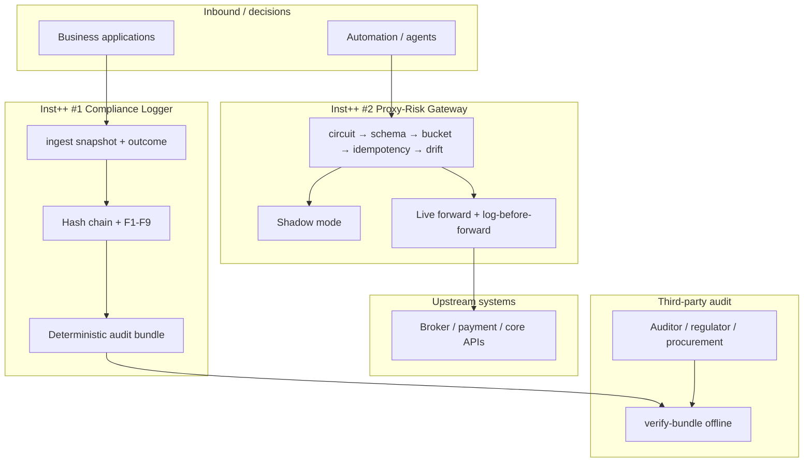

# Inst++ Deep Dive — Compliance Logger & Proxy-Risk Gateway

**Audience:** Technical buyers, auditors, diligence teams, enterprise architects.  
**Products:** #1 Compliance Logger · #2 Proxy-Risk Gateway  
**Status:** Gold standard (70 tests, rigorous E2E log, offline verify-bundle)  
**Proof log:** `docs/test_logs/instpp_rigorous_latest.log`

---

## Executive thesis

Most “compliance” and “API risk” products optimise for **dashboards and workflows**. Inst++ optimises for **cryptographic proof** — evidence a third party can replay **without calling the vendor**.

| Dimension | Industry default | Inst++ edge |
|-----------|------------------|-------------|
| Audit artifact | CSV / PDF export (editable) | Genesis-anchored hash chain + deterministic tar + SHA256 |
| Verification | Trust the vendor UI | Offline `verify-bundle` — auditor dry-run |
| Clock integrity | Wall-clock timestamps (spoofable) | Lamport logical clocks (F4) — chain valid even if wall time attacked |
| API risk | Rate limit OR log OR kill (rarely all three) | Circuit → bucket → idempotency → Z-score → **logged** outcome |
| Deploy model | Multi-tenant SaaS only | Air-gapped VPC / on-prem — WAL + SQLite local |
| Reproducibility | “Trust our export” | F9 gate — identical ledger state → identical bundle hash |

**One-line pitch:** *DV/IAS prove where ads run; NeMo/Bedrock prove what copy says; Inst++ proves what your systems decided and what left your API boundary — with math, not slides.*

---

## Where these products sit in the enterprise stack



**Compliance Logger** = evidence layer for **decisions already made**.  
**Proxy-Risk** = control layer for **traffic about to leave**.  
Both share `inst_spine` — same genesis protocol, same export pipeline, same F-gate vocabulary.

---

# Product #1 — Compliance Logger

## One job

Record every regulated decision (approve / deny / escalate) with an **input snapshot**, **outcome**, and **tamper-evident chain** that survives vendor dispute.

## Industry landscape

| Category | Incumbents | What they do well | Where they stop |
|----------|------------|-------------------|-----------------|
| **GRC platforms** | ServiceNow GRC, Archer, MetricStream | Workflow, policy mapping, attestations | Export is report-shaped, not chain-shaped |
| **Immutable audit DBs** | immudb, Trillian, Amazon QLDB | Append-only / Merkle storage | Generic — no decision snapshot schema, no F1–F9 gate pack |
| **SIEM / log platforms** | Splunk, Datadog, Elastic | Volume, search, alerting | Logs are not decision proofs; retention ≠ integrity |
| **Spreadsheet compliance** | Excel + email | Cheap | Zero integrity; fails any serious audit |
| **Blockchain theatre** | Private chain vendors | Marketing | Over-engineered; auditors still can’t offline-verify without nodes |

### Inst++ positioning vs incumbents

| Capability | GRC SaaS | immudb-class | **Inst++ Compliance Logger** |
|------------|----------|--------------|------------------------------|
| Decision snapshot + outcome | Custom fields | BYO schema | **First-class ingest contract** |
| Tamper detection | Role-based access | Merkle / immutability | **Sequential hash chain + genesis anchor** |
| Clock-attack resistance | Weak (NTP trust) | Varies | **Lamport monotonic (F4)** |
| Offline auditor replay | No | Partial (needs DB) | **`verify-bundle` on tarball only** |
| Deterministic export hash | No | No | **F9 reproducibility gate** |
| Air-gapped deploy | Rare | Yes | **Yes — default architecture** |
| Workflow UI | **Strong** | No | **Guided proof workflow** (`inst-workflow serve`) |

**Win when:** buyer needs **proof**, not **process**. Legal, risk, model governance, NGB DIAP evidence, fintech model approval trails.  
**Lose when:** buyer needs case management, policy workflow, SOC 2 certified SaaS out of the box.

---

## Technical architecture (deep)

### Durability model — two-phase write

```
Client call
    │
    ▼
SYNC: AppendOnlyWal.fsync()     ◄── survives crash before SQLite flush
    │
    ▼
ASYNC (optional): SQLite index  ◄── query / export convenience
```

Block 0 is a **genesis record** — installation origin bound to a sidecar anchor file:

```
H_n = SHA256( canonical(payload + metadata) || H_{n-1} || lamport_n )
```

- **Genesis anchor** (`.genesis.json`) — if ledger file is swapped, anchor mismatch fails export (tested in rigorous suite).
- **Lamport clocks** — wall time is metadata only; backdating wall clock does not break chain validity (F4).

### F1–F9 evidence matrix

| Gate | Question answered | Inst++ mechanism |
|------|-------------------|------------------|
| **F1** | Were all decisions captured? | `expected_snapshots` vs `actual_snapshots` |
| **F2** | Is every row tied to a run manifest? | `manifest_id` on non-genesis entries |
| **F3** | Was the chain spliced? | `verify_chain()` O(n) walk |
| **F4** | Was time manipulated? | Lamport strict monotonic per writer |
| **F5** | Did config drift from install? | Genesis anchor `config_hash` vs block 0 |
| **F6** | Do counts reconcile? | `expected_count` vs `actual_count` |
| **F7** | Was input data complete? | **Snapshot field coverage %** per decision |
| **F8** | Retention policy honoured? | Policy flag (extensible) |
| **F9** | Is export deterministic? | Two exports → identical SHA256 |

F7 is **not theatre** — coverage is computed from `required_snapshot_fields` in RunManifest or ingest args, stored in entry metadata, aggregated as weakest-link min %.

### Export pipeline (P2)

```
validate_before_export()
  → genesis OK + chain OK + lamport OK
  → institutional check (F1–F9)
  → abort if any fail
  → canonical JSON files (sorted keys)
  → deterministic tar (mtime=0, sorted paths)
  → SHA256 sidecar
```

**Auditor path (no vendor, no live DB):**

```bash
compliance-log export --database ./ledger.sqlite
compliance-log verify-bundle --tarball ./audit_bundle.tar
# Optional offsite genesis:
compliance-log verify-bundle --tarball ./audit_bundle.tar --anchor ./offsite_genesis.json
```

Bundle `MANIFEST.json` includes `"product": "compliance-logger"` for portfolio disambiguation.

---

## Tech edge summary — Compliance Logger

1. **Genesis-bound installation** — not just “append-only table” but provable origin.
2. **Offline verify-bundle** — auditor needs tarball + optional anchor, not your production DB.
3. **F9 reproducibility** — export integrity is a **testable gate**, not a claim.
4. **Observation lane** — `--observation-lane` runs blocking subset (F3/F4/chain) for burn-in without full F7/F9.
5. **Typed CLI errors** — `InstError` JSON envelope; diligence-clean failures.

**Measured proof (repo):** 45 unit + 20 E2E sections in `instpp_rigorous_test.sh`; log archived in `docs/test_logs/`.

---

# Product #2 — Proxy-Risk Gateway

## One job

Sit in front of outbound broker, payment, or automation APIs as an **institutional circuit breaker** — rate limit, dedupe, detect drift, kill traffic, and **log every gate outcome** to the same spine Compliance Logger uses.

## Industry landscape

| Category | Incumbents | What they do well | Where they stop |
|----------|------------|-------------------|-----------------|
| **API gateways** | Kong, Apigee, AWS API GW | Routing, auth, basic rate limits | No Z-score kill; audit is access log not decision log |
| **Service mesh** | Istio, Linkerd | mTLS, traffic policy | Infra-centric; not spend/drift aware |
| **WAF / edge** | Cloudflare, Akamai | DDoS, OWASP | Not application-intent aware |
| **Broker OEM tools** | Interactive Brokers, Bloomberg EMSX wrappers | Connectivity | Per-vendor; no cross-broker governance chain |
| **Chaos / kill switches** | Custom scripts, feature flags | Fast to hack | No cryptographic trail; no idempotency mesh |
| **Pre-bid ad verification** | DoubleVerify, IAS | Sub-ms placement | **Wrong layer** — auction not API |

### Inst++ positioning vs incumbents

| Capability | API gateway | Custom scripts | **Inst++ Proxy-Risk** |
|------------|-------------|----------------|------------------------|
| Token bucket rate limit | Yes | Sometimes | **Yes — Redis atomic Lua or memory** |
| Idempotency / dedupe | Plugin / manual | Rare | **First-class async CAS (Redis/memory)** |
| Statistical kill (Z-score) | No | Sometimes | **EMA drift detector + circuit kill** |
| Shadow mode | No | Sometimes | **Default — gates without upstream call** |
| Log-before-forward (live) | No | Rare | **Sync WAL before httpx upstream** |
| Fail-closed on upstream 5xx | Often passes through | Varies | **REJECT + ledger entry** |
| Fail-closed on Redis outage | Often fails open | Varies | **Reject traffic (bucket + idempotency)** |
| Every gate outcome logged | Access log only | Varies | **approve / reject / kill all logged** |
| Audit export same as compliance | No | No | **Same F1–F9 + verify-bundle** |
| Sub-5ms RTB insert | N/A | N/A | **No (non-goal)** |

**Win when:** fintech ops, quant broker proxy, payment rail guard, agent automation outbound — buyer values **kill switch + proof**.  
**Lose when:** sub-millisecond exchange co-location, full API management suite, or HashiCorp Vault+HSM requirement in RFP.

---

## Technical architecture (deep)

### Hot path gate chain (memory only, p99 target &lt; 10ms shadow)

```
Request
  │
  ├─► CircuitBreaker (KILL env / drift kill)
  ├─► Schema (client_id, method, path, method whitelist)
  ├─► TokenBucket (per-client, Redis Lua atomic)
  ├─► IdempotencyBackend (Redis CAS / memory TTL)
  ├─► ZScoreDriftDetector (EMA μ, σ — kill if |Z| > z_max)
  │
  ├─► [shadow] ──► ledger append (async) ──► APPROVE
  │
  └─► [live] ──► SYNC WAL "forward pending"
                 ──► httpx upstream
                 ──► if status >= 400: REJECT (fail-closed)
                 ──► else: ledger append ──► APPROVE
```

### Why log-before-forward matters

Most proxies log **after** upstream success — a crash between forward and log creates **silent capital exposure**. Inst++ live mode:

1. **Sync WAL** append with `forward pending`
2. Upstream call
3. Ledger append with final status

Auditor sees intent before execution — institutional standard for trading ops.

### Shadow → live promotion path

| Phase | Command | Risk |
|-------|---------|------|
| Burn-in | `proxy-risk evaluate` (default shadow) | Zero upstream exposure |
| Gate proof | `proxy-risk check` + `export --repro-check` | Evidence package for committee |
| Live | `PROXY_RISK_UPSTREAM_BASE=... proxy-risk evaluate --live` | Real forward; fail-closed on errors |
| Emergency | `INST_CIRCUIT_KILL=1` | Immediate KILL at circuit layer |

### Multi-instance production

| Component | Single process | Multi-instance |
|-----------|----------------|----------------|
| Token bucket | `MemoryTokenBucketBackend` | `RedisTokenBucketBackend` (Lua atomic) |
| Idempotency | `MemoryIdempotencyBackend` | `RedisIdempotencyBackend` (Lua CAS) |
| Ledger | Local SQLite + WAL | Per-instance ledger or shared writer (P3 roadmap) |

Env: `INST_REDIS_URL` — both backends fail-closed on Redis errors (tested).

### Latency evidence

From rigorous test suite (10,000 shadow evaluations, in-process):

| Percentile | Latency |
|------------|---------|
| p50 | ~0.004 ms |
| p99 | ~0.006 ms |
| p999 | ~0.012 ms |

**Claim discipline:** shadow in-memory bench, not colocated exchange insert. Production multi-instance adds Redis RTT — still API-proxy class (&lt;10ms), not RTB class (&lt;1ms).

---

## Tech edge summary — Proxy-Risk

1. **Full gate audit trail** — reject and kill are first-class ledger events, not silent drops.
2. **Fail-closed live forward** — upstream 4xx/5xx → REJECT, not false approve.
3. **Shadow default** — institutional burn-in before capital exposure.
4. **Same proof pack as Compliance** — one diligence language for ops + legal.
5. **Fork surface for #5 Webhook Mesh and #6 Ad Guard** — 75–85% spine reuse (proven in repo).

---

# Shared spine — the real moat

Both products are thin packages over `inst_spine`. The IP is not “another logger” — it is the **protocol**:

| Module | Function |
|--------|----------|
| `hash.py` | Genesis block, chain_hash, verify_chain, anchor |
| `wal.py` | Sync fsync before ack |
| `ledger.py` | Append-only + async SQLite write-behind |
| `gates/engine.py` | F1–F9 staged evidence |
| `export.py` | Deterministic bundle + offline verify |
| `rates.py` | Redis atomic bucket + idempotency CAS |
| `check.py` | Unified institutional orchestrator |

**Cost-to-replicate estimate (honest):** 2–3 senior engineer-months for genesis + WAL + F-gates + deterministic export — before product packaging, tests, and docs. That is the IP floor; traction sets ceiling.

---

# Competitive “edge scorecard”

Score 1–5 (5 = institutional leading for that niche)

| Criterion | Compliance Logger | Proxy-Risk | Notes |
|-----------|-------------------|------------|-------|
| Cryptographic integrity | **5** | **5** | Shared chain |
| Offline auditor replay | **5** | **5** | verify-bundle |
| Workflow / GRC UI | **5** | **5** | Guided 5-step console per product — proof workflow, not case management |
| Air-gap deploy | **5** | **5** | Local WAL/SQLite |
| Multi-tenant SaaS | 2 | 2 | Buyer-operated |
| API gateway features | — | 3 | Routing/plugins not scope |
| Statistical kill switch | — | **4** | Z-score + circuit |
| Sub-ms latency | — | 1 | Honest non-goal |
| Deterministic repro (F9) | **5** | **5** | Rare in market |
| Diligence cleanliness | **4** | **4** | 70 tests, typed errors, buyer docs |

**Combined edge:** strongest where **regulators, legal, or procurement** ask “show us the math” — not where they ask “show us the dashboard”.

---

# Diligence evidence package

Run before any enterprise call:

```bash
pip install -e ".[dev,instpp]"
./scripts/instpp_smoke_test.sh           # 70 tests
./scripts/instpp_rigorous_test.sh        # full logged E2E → docs/test_logs/
./scripts/demo_compliance_logger.sh      # 60s product #1
./scripts/demo_proxy_risk.sh             # 60s product #2
inst-workflow serve --port 8790          # browser workflow console
```

| Artifact | Path |
|----------|------|
| Rigorous log | `docs/test_logs/instpp_rigorous_latest.log` |
| JSON summary | `docs/test_logs/instpp_rigorous_latest_summary.json` |
| Gold standard criteria | `docs/INST_PLUS_GOLD_STANDARD.md` |
| Buyer one-pagers | `docs/COMPLIANCE_LOGGER_BUYER.md`, `docs/PROXY_RISK_BUYER.md` |
| Enterprise stack map | `docs/INSTITUTIONAL_ENTERPRISE_STACK.md` |

---

# RFP deflection cheat sheet

| Buyer asks | Product | Answer |
|------------|---------|--------|
| Tamper-proof decision audit trail | #1 | **Yes** — genesis chain + offline verify |
| Prove model approval on date X | #1 | **Yes** — snapshot + outcome + export |
| Outbound API rate limit + kill switch | #2 | **Yes** — bucket + Z-score + circuit |
| Shadow burn-in before live trading | #2 | **Yes** — default shadow mode |
| Webhook double-billing protection | #5 | **Yes** — Webhook Mesh (separate SKU) |
| Marketing API spend anomaly | #6 | **Yes** — Ad Guard (separate SKU) |
| Sub-ms RTB pre-bid verification | — | **No** — DV/IAS |
| LLM creative safety | — | **No** — NeMo/Bedrock downstream |
| GRC workflow + attestations UI | — | **Partial** — `inst-workflow` guided proof console; integrate export into full GRC |
| SOC 2 Type II certified SaaS | — | **Not yet** — packaging; deploy in buyer VPC |

---

# Pricing & packaging (sell separately)

| Product | Band | Buyer |
|---------|------|-------|
| Compliance Logger | £300–£800/mo tenant | Legal, risk, governance |
| Proxy-Risk Gateway | £400–£1,200/mo tenant | Fintech ops, quant infra |
| Combined diligence bundle | Custom | Only when same holding co buys both |

**Never bundle with HIBS sports products** in one listing — different buyers, different diligence.

---

# What “leading edge” does NOT mean

Honest boundaries preserve credibility in enterprise sales:

1. **Not immudb** — we are decision-proof specialised, not general immutable SQL.
2. **Not Kong/Apigee** — we are risk+gates+proof, not full API lifecycle.
3. **Not DV/IAS** — we do not touch auction placement.
4. **Not NeMo** — we do not run LLM safety inference.
5. **Not SOC 2 certified** — yet; air-gap deploy shifts control to buyer.

Leading edge **here** = *cryptographic decision proof + fail-closed outbound control* in a deployable, testable, auditor-friendly package.

---

## Related documents

- `docs/INST_PLUS_GOLD_STANDARD.md` — six-dimension quality bar
- `docs/INST_PLUS_STRATEGY.md` — portfolio strategy
- `docs/INST_PLUS_TEST_AND_DEMO.md` — command playbook
- `src/compliance_log/README.md` — product #1 architecture
- `src/proxy_risk/README.md` — product #2 architecture
