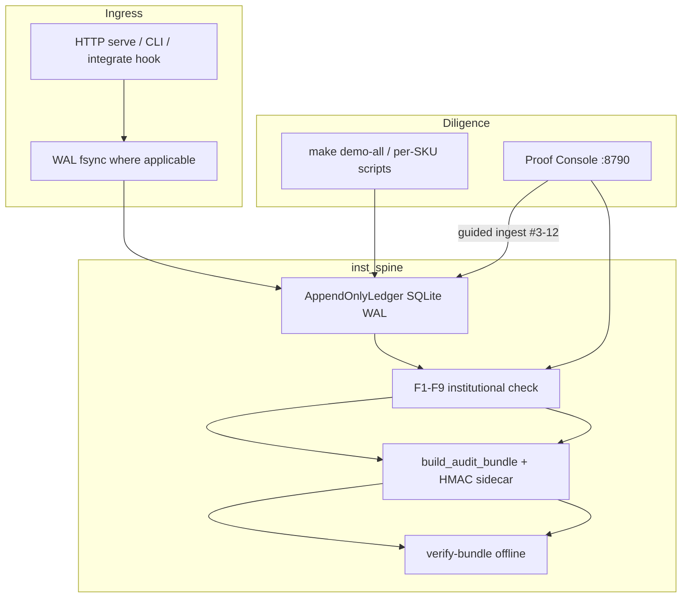

# Institutional++ Production Architecture

**Purpose:** Industry-standard map of architecture, code execution paths, and production readiness criteria for all 12 SKUs.  
**Audience:** Platform engineering, InfoSec, procurement diligence.  
**Date:** July 2026

---

## Production readiness definition

| Layer | Meaning | Gate |
|-------|---------|------|
| **Institutional gold** | F1–F9 + `verify-bundle` + rigorous E2E | CI `instpp_rigorous_test.sh` per SKU |
| **Production (single-instance VPC)** | Air-gap SQLite + WAL, HTTP `/health` + `/ready` (where served), CLI export path | No Redis/Postgres required |
| **Scale profile** | Multi-replica HA | `INST_PRODUCTION_PROFILE=1` + Redis streams / Postgres — see [PRODUCTION_REDIS_PROFILE.md](PRODUCTION_REDIS_PROFILE.md) |

**Prod ✅** in the completion matrix means **single-tenant VPC envelope complete**. Redis, Postgres, and buyer-specific feed integrations are **scale or SOW items**, not license blockers.

---

## Spine architecture (all SKUs)



Shared libraries: `inst_spine` (ledger, clocks, export, production profile), `inst_workflow` (Proof Console catalog + guided ingest).

---

## Per-SKU execution map

| # | SKU | Ingress | Ledger writer | HTTP serve | CLI | Integrate hook |
|---|-----|---------|---------------|------------|-----|----------------|
| 1 | Compliance Logger | `compliance_log/ingest.log_decision` | `compliance.sqlite` | `:8785` | `compliance-log` | — |
| 2 | Proxy-Risk | `proxy_risk/router.ProxyRiskGateway.evaluate` | `proxy_risk_ledger.sqlite` | `:8786` | `proxy-risk` | middleware |
| 3 | Alt-Data | `altdata/poll.poll_once` | `altdata.sqlite` | `:8787` | `altdata` | feed poll worker |
| 4 | AI Kit | `ai_kit/pipeline.AgentLoop.run_steps` | `ai_kit_trace.sqlite` | — | `ai-kit` | agent runtime |
| 5 | Webhook Mesh | HMAC ingress → WAL → queue | `webhook_mesh.sqlite` | `:8787` | `webhook-mesh` | ingress handler |
| 6 | Ad Guard | `ad_guard/proxy.AdGuardGateway.evaluate` | `ad_guard.sqlite` | `:8788` | `ad-guard` | spend gate |
| 7 | Health Telemetry | `health_telemetry/ingest.ingest_batch` | `health.sqlite` | `:8793` | `health-telemetry` | device gateway |
| 8a | ModelGovernor | `model_governor/record.record_governance_event` | `model_governor.sqlite` | — | `model-governor` | deploy gate |
| 9 | Drift Gate | `drift_gate/integrate.evaluate_model_features` | `drift_gate.sqlite` | — | `drift-gate` | proxy / MG hook |
| 10 | Webhook Replay | `webhook_replay/replay_engine.ReplayEngine` | `webhook_replay.sqlite` | — | `webhook-replay` | mesh capture |
| 11 | Spend Guard | `spend_guard/gateway.SpendGuardGateway` | `spend_guard.sqlite` | `:8789` | `spend-guard` | LLM gateway |
| 12 | Agent Ledger | `agent_ledger/integrate.authorize_tool_call` | `agent_ledger.sqlite` | `:8792` | `agent-ledger` | LangChain hook |

---

## Proof Console guided ingest (#3–#12)

**Module:** `src/inst_workflow/proof_ingest.py`  
**API:** `GET /api/proof/{id}/demo-payload` · `POST /api/proof/{id}/ingest`

| SKU | Demo action | Offline-safe |
|-----|-------------|--------------|
| Compliance | `log_decision` — snapshot + outcome | ✅ |
| Proxy-Risk | Shadow `evaluate` (`live: false`) | ✅ |
| Alt-Data | `poll_once` stub feed | ✅ |
| AI Kit | AgentLoop stub steps | ✅ |
| Webhook Mesh | Cold-path ingress ledger append | ✅ |
| Ad Guard | Shadow `evaluate` | ✅ |
| Health | `ingest_batch` + auto seq | ✅ |
| ModelGovernor | `record_governance_event` | ✅ |
| Drift Gate | Synthetic baseline + shadow evaluate | ✅ |
| Webhook Replay | capture → replay | ✅ |
| Spend Guard | init wallet → reserve → settle | ✅ |
| Agent Ledger | authorize / complete | ✅ |

Compliance (#1) and Proxy (#2) use the same Proof tab ingest flow as SKUs #3–#12.

---

## Single-instance `/ready` criteria

Without `INST_PRODUCTION_PROFILE=1`:

| SKU | `/ready` requires |
|-----|-------------------|
| Proxy-Risk | Ledger file + chain (shadow: memory backends OK) |
| Alt-Data | Ledger file + chain |
| Webhook Mesh | `WEBHOOK_PROVIDER_SECRET`, WAL online, background queue |
| Ad Guard | Ledger file + chain (shadow) |
| Health Telemetry | Ledger file + chain |
| Spend Guard | Wallet + ledger files, wallet readable |
| Agent Ledger | Ledger + permit DB + chain |
| inst-workflow | 12/12 portfolio DBs seeded |

Rigorous proof: `tests/test_sku_production_envelope.py`

---

## ModelGovernor — same SKU or separate from “governor spine”?

| Name | What it is | In 12-SKU portfolio? |
|------|------------|----------------------|
| **`inst_spine`** | Shared audit library (genesis chain, F1–F9, export, verify) used by **all** SKUs | No — infrastructure, not a product |
| **#8a ModelGovernor** (`src/model_governor/`, CLI `model-governor`) | ML lifecycle governance SKU — register / approve / deploy / retire with `artifact_hash` | **Yes — SKU #8** |
| **#8b spend plane** (`make demo-gold`) | Sales walkthrough for **Spend Guard (#11)** — reserve → settle → drift lockout | **No** — not a separate CI SKU; grouped historically under “ModelGovernor” marketing |
| **Drift Gate (#9)** | Statistical drift interceptor; integrates with Proxy + ModelGovernor deploy gate | **Yes — separate SKU #9** |
| **hibs_racing / governor consumer apps** | Sports/trading overlay — explicitly **out of Inst++ scope** | **No** |

**Answer:** The listed **ModelGovernor SKU is one product** (`model-governor`). It runs **on** `inst_spine`; it is not a second “governor spine” product. Do not confuse #8a with #8b (Spend Guard demo) or with out-of-scope consumer apps.

---

## Docker extreme rigorous — per SKU

| Command | What it does |
|---------|----------------|
| `make docker-sku-rigorous` | 12 **isolated** `python:3.11-slim` containers — unit tests + demo + F1–F9 + verify-bundle per SKU |
| `make docker-extended` | Redis + Postgres compose + full `instpp_rigorous_test.sh` on host (integration soak) |

**Per-SKU logs:** `docs/test_logs/instpp_docker_sku_<sku>_<timestamp>.log`  
**Matrix summary:** `docs/test_logs/instpp_docker_sku_latest_summary.json`  
**CI job:** `docker-sku-rigorous` (workflow_dispatch + weekly schedule)

Each container runs `scripts/docker_sku_rigorous_one.sh <sku>` with `SKIP_LIVE=1` and shared Redis/Postgres on host network for scale-profile SKUs.

---

## Scale profile (optional)

When `INST_PRODUCTION_PROFILE=1` or multi-instance deploy:

| SKU | Additional requirement |
|-----|------------------------|
| #2, #6 | `INST_REDIS_URL` — token bucket + idempotency CAS |
| #5 | `WEBHOOK_DISPATCH_MODE=redis` — durable stream queue |
| #9 | Redis rolling windows for enforce at scale |
| #11 | Postgres wallet when `INST_REQUIRE_POSTGRES=1` |
| #3 | Buyer feed URLs — integration SOW (not spine gap) |

---

## Demo & diligence commands

```bash
make demo-all                    # Seed all 12 portfolio DBs
make demo-gold-up                # Proof Console :8790
./scripts/instpp_proof_lite.sh  # Production profile + portfolio verify
./scripts/instpp_smoke_test.sh   # Fast regression
```

**Diligence pack index:** [INST_PLUS_DILIGENCE_PACK.md](INST_PLUS_DILIGENCE_PACK.md)
