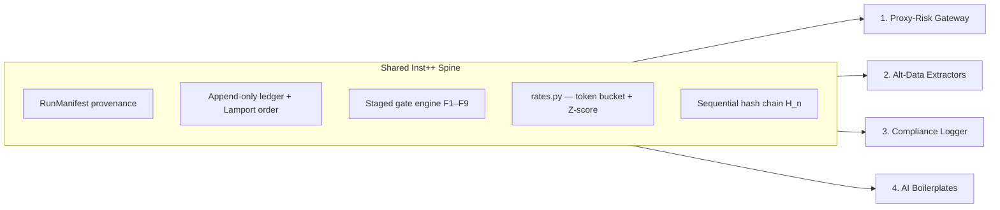

# Four New Products — Inst++ Grade Roadmaps (v2)

**Scope:** Brand-new B2B/B2C products — not extensions of Hibs Racing  
**Bar:** Institutional++ = does one job extremely well, with tamper-evident audit, staged enforcement, and operational kill switches  
**Source patterns:** Extracted from `hibs-racing` institutional layer — **decoupled at build time, never imported at runtime**

> **v2 changes:** Addresses B2B infrastructure gaps — async hot path, formal math, Lamport ordering, structural scrape fallback, revised `inst-spine/` layout.  
> **v3 implemented:** Sync WAL before SQLite write-behind, Genesis Block protocol + anchor sidecar, pluggable token-bucket backends (memory / Redis Lua).

---

## v3 Hardening — Implemented in Code

### 1. WAL + write-behind (ledger crash safety)

**Problem:** Async SQLite write-behind alone loses `H_{n-1}` state on crash before buffer flush.

**Fix (`inst_spine/wal.py` + `ledger.py`):**

```
SYNC (request path):  append JSON line to .wal + fsync  →  sub-ms durability
ASYNC (background):   SQLite indexing / query surface
RECOVERY (startup):   replay WAL → SQLite for any missing entry_ids
```

`list_entries()` reads from **WAL** (authoritative), not SQLite lag.

### 2. Pluggable token bucket (multi-instance Proxy-Risk)

**Problem:** In-memory buckets double effective rate across two Docker instances.

**Fix (`inst_spine/rates.py`):**

| Backend | Use case | Activation |
|---------|----------|------------|
| `MemoryTokenBucketBackend` | AI Kit, single-process proxy | Default |
| `RedisTokenBucketBackend` | Multi-instance Proxy-Risk | `INST_REDIS_URL=redis://...` |

Atomic consume via Redis Lua script. Shared `key` per `client_id` enforces global rate.

### 3. Genesis Block protocol (anti wipe-and-rebuild)

**Problem:** Empty `H_0 = null` lets an attacker wipe SQLite and start a fake chain.

**Fix (`inst_spine/hash.py`):**

- **Block 0** written at install: `instance_uuid`, `config_hash`, `lamport_seq=0`, `prev_hash=GENESIS_PREV_HASH`
- **Anchor sidecar** `{db}.genesis.json` — `genesis_hash` + `instance_uuid` (immutable install receipt)
- `verify_chain()` **fails** on empty chain or missing/tampered genesis
- `verify_genesis_block()` cross-checks anchor vs block 0

Wipe SQLite only → WAL + anchor recover. Wipe WAL + SQLite without anchor → new install (old chain dead — correct).

---

## Strategic Frame

These four products share one architectural spine but serve different buyers:



**Design rule:** Each product is a **standalone package** with zero sports-domain imports. Racing code is the reference implementation only.

| Product | One job | Inst++ means | Price band |
|---------|---------|--------------|------------|
| **1. Proxy-Risk Gateway** | Stop bad automation before it hits live APIs | p99 gate latency <5ms; Z-score kill; async hot path | £199–499/mo per instance |
| **2. Alt-Data Extractors** | Deliver one clean telemetry feed | ≥95% coverage + structural fallback when DOM breaks | £500–2,000/mo per feed |
| **3. Compliance Logger** | Prove what the system decided and when | Lamport-ordered hash chain auditors can replay | License + maintenance retainer |
| **4. AI Boilerplates** | Ship AI apps without rate-limit/state bugs | Token-bucket burst control + checkpoint recovery | £99–249 lifetime/seat |

---

## Critical Gaps — Sports Loop vs Open B2B (and fixes)

Moving from a single-tenant cron sports loop to open B2B infrastructure exposes three structural flaws in v1. Each has a concrete fix baked into the roadmaps below.

### Gap 1: Proxy-Risk latency & concurrency bottleneck

**Flaw:** The sports execution engine runs on cron/low-frequency webhooks. A B2B proxy must process requests **synchronously**. Piping traffic through a Python Gate1→Gate2→Gate3 chain with synchronous code and SQLite reads on the hot path adds tens of milliseconds per hop — unusable for algorithmic clients.

**Fix:**

| Layer | Requirement |
|-------|-------------|
| **Runtime** | `asyncio` + `uvloop` event loop — near-native I/O concurrency |
| **Hot path state** | Velocity counters, idempotency keys, token buckets → **Redis** (or in-process dict + periodic flush for single-tenant) |
| **Cold path** | Ledger append, manifest write → **async write-behind queue** to SQLite; never block upstream on disk |
| **SLA** | p99 gate evaluation <5ms; p99 end-to-end proxy overhead <15ms (excluding upstream RTT) |

```
[HOT PATH — memory only, <5ms]
  auth → schema → token_bucket → idempotency bitmap → z_score_drift → APPROVE|REJECT|KILL

[COLD PATH (async queue, non-blocking)]
  SYNC WAL fsync (mandatory) → async SQLite index → export_audit.sh
```

### Gap 2: Compliance logger clock drift vulnerability

**Flaw:** F4 "timeline monotonic — no backdating" breaks if Docker/VPS clocks drift, NTP steps backward, or a root actor adjusts system time. Hash chains keyed on `time.time()` become mathematically invalid under clock manipulation.

**Fix:**

| Mechanism | Role |
|-----------|------|
| **Lamport clock** | Logical sequence counter per writer — guarantees causal order independent of wall clock |
| **Vector clock** (optional P3) | Multi-writer deployments — detect concurrent events across nodes |
| **`time.CLOCK_MONOTONIC`** | Elapsed-time measurements only — never moves backward regardless of NTP |
| **Wall clock** | Stored as **metadata** (`wall_time_utc`) for human audit — **not** used for chain integrity |

F4 revised pass condition: `lamport_seq` strictly increasing per writer; `verify_chain()` uses `H_n` formula, not timestamp ordering.

### Gap 3: Alt-Data structural fragility

**Flaw:** Sports APIs (API-Football, Racing API) are standardized. Corporate targets (airlines, retail, shipping) use Cloudflare/Akamai and change DOM layouts frequently. A rigid CSS-selector field ladder breaks weekly.

**Fix — structural fallback ladder (fourth rung):**

```
Rung 1: Primary API / structured JSON endpoint
Rung 2: Secondary API or cached mirror
Rung 3: CSS/XPath selector (versioned per target — expect breakage)
Rung 4: Structural rescue — pipe raw HTML chunk to lightweight local extractor
        (regex template + optional small token-classification model)
        → isolate field by semantic label proximity, not brittle selectors
```

Rung 4 runs **offline from the poll hot path** (async worker). Coverage SLA counts rung 4 rescues separately in manifest extras.

---

## Formal Mathematics (Inst++ requirement)

Three mathematical components are **mandatory** in `inst-spine/rates.py` and `inst-spine/hash.py`. Products import these — they do not reimplement.

### 1. Token bucket rate limiting (Proxy-Risk + AI Kit)

Permits brief bursts while enforcing a sustainable average rate. Replaces vague "velocity caps."

\[
T_t = \min\!\left(B,\; T_{\text{last}} + (t - t_{\text{last}}) \times R\right)
\]

| Symbol | Meaning |
|--------|---------|
| \(B\) | Maximum bucket capacity (burst size) |
| \(R\) | Token replenishment rate (tokens per second) |
| \(T_t\) | Current token count at time \(t\) |

**Rule:** A request of cost \(C\) is **rejected** (or delayed in AI Kit) if \(T_t < C\). On accept: \(T_t \leftarrow T_t - C\).

Implementation: in-memory per `(client_id, endpoint)` for dev; **Redis Lua** when `INST_REDIS_URL` set (Proxy-Risk production).

### 2. Sequential hash chain (Compliance Logger + all products)

Proves no retroactive alteration or deletion. Each block encapsulates the preceding state.

\[
H_n = \text{SHA256}\!\left(M_n \,\|\, H_{n-1} \,\|\, \text{lamport}_n\right)
\]

| Symbol | Meaning |
|--------|---------|
| \(M_n\) | Canonical JSON of entry metadata + snapshot payload |
| \(H_{n-1}\) | Hash of the entire preceding ledger row (genesis: 64 zero hex chars) |
| \(\text{lamport}_n\) | Lamport sequence integer — **not** wall-clock time |

**Tamper detection:** Deleting or altering entry \(n-5\) invalidates \(H_{n-4}, \ldots, H_n\). `export_audit.sh` walks the chain in O(n) and reports first mismatch index.

This supersedes the racing `bet_verification_hash()` (single-row hash). Inst++ requires **chained** hashes.

### 3. Rolling Z-score drift detection (Proxy-Risk P2)

Flat percentage drift (>X%) fails in high-volatility regimes. Replace with rolling volatility Z-score:

\[
Z = \frac{P_{\text{current}} - \mu_t}{\sigma_t}
\]

| Symbol | Meaning |
|--------|---------|
| \(\mu_t\) | EMA of reference price over trailing window \(W\) |
| \(\sigma_t\) | EMA of rolling standard deviation over same window \(W\) |
| \(P_{\text{current}}\) | Incoming quote or order price |

**Rule:** Kill-switch triggers when \(|Z| > Z_{\max}\) (default \(Z_{\max} = 3.0\) — three sigma). Window \(W\) and \(Z_{\max}\) are per-asset config in `proxy-risk/config.yaml`.

EMA update (per tick):

\[
\mu_t = \alpha \cdot P_{\text{current}} + (1-\alpha)\cdot\mu_{t-1}, \quad \alpha = \frac{2}{W+1}
\]

\(\sigma_t\) uses EMA of squared deviations — same \(\alpha\).

---

## Universal Inst++ Checklist (all four products)

| # | Capability | v1 gap | v2 requirement |
|---|------------|--------|----------------|
| 1 | **Run manifest** | — | Every batch/job: `manifest_hash` over config + code version + inputs |
| 2 | **Append-only ledger** | SQLite on hot path (Proxy) | Hot path memory → async write-behind; SQLite audit only |
| 3 | **Hash chain** | Single-row `verification_hash` | Sequential \(H_n\) with \(H_{n-1}\) linkage |
| 4 | **Logical ordering** | Wall-clock F4 | Lamport seq + `CLOCK_MONOTONIC` for durations |
| 5 | **Staged gates** | — | F1–F9 via `gates/engine.py`; every reject has `gate_reason` |
| 6 | **Circuit breaker** | — | `gates/circuit.py` — global KILL independent of app |
| 7 | **Rate limits** | "Polite sleep" only | Formal token bucket in `rates.py` |
| 8 | **Drift detection** | Flat % threshold | Z-score with configurable \(Z_{\max}\) and EMA window |
| 9 | **Health orchestrator** | — | `check.py` — single CLI pass/fail |
| 10 | **Export data room** | — | `export_audit.sh` — chain verify + gate report ZIP |

---

## Shared Package Structure — `inst-spine/` (canonical)

```
inst-spine/
├── __init__.py
├── contracts.py          # Dataclasses + Pydantic schemas (RunManifest, LedgerEvent, ApiIntent)
├── ledger.py             # Append-only storage; Lamport clock integration; async write-behind
├── hash.py               # H_n chain construction + verify_chain()
├── rates.py              # Token bucket limiter + Z-score EMA drift detector
├── clocks.py             # LamportClock, optional VectorClock, CLOCK_MONOTONIC helpers
├── gates/
│   ├── __init__.py
│   ├── engine.py         # F1–F9 execution matrix; staged gate protocol
│   └── circuit.py        # Global kill-switches; credential vault interface
├── check.py              # Unified institutional verification orchestrator
└── export_audit.sh       # Hardened bundle compiler — chain walk + gate report
```

**Dependency rule:** `inst-spine` has zero domain imports. Products import `inst-spine` only. Sports code never imports products.

**Extract order:**

1. `hash.py` + `clocks.py` + `ledger.py` (Compliance Logger P0)
2. `rates.py` (Proxy-Risk P1 + AI Kit P0)
3. `gates/engine.py` + `gates/circuit.py` (all products)
4. `check.py` + `export_audit.sh` (Compliance P2)

---

## Product 1: Proxy-Risk Gateway

### One job

Air-gapped circuit breaker between automation scripts and live broker/payment APIs. **Nothing else.**

### Architecture (v2 — async hot path)

```
[Client] ──async──► [uvloop proxy :8443]
                          │
                    HOT PATH (<5ms, memory)
                          ├─ Gate1: auth + Pydantic schema
                          ├─ Gate2: token bucket (rates.py) + idempotency (Redis)
                          ├─ Gate3: Z-score drift (rates.py) — |Z| > 3 → KILL
                          ├─ circuit.py: global KILL flag
                          └─ APPROVE → forward async upstream
                          │
                    COLD PATH (async queue)
                          └─ ledger append H_n → SQLite (write-behind)
```

**Kill switch:** Gateway holds API credential. `circuit.py` KILL severs upstream pool instantly — no client cooperation required.

### Codebase mapping (reference only)

| Racing reference | Port to |
|------------------|---------|
| `execution_router.py` | `proxy-risk/router.py` (async) |
| `actionability.py` | `proxy-risk/gates/` wrapping `inst-spine/gates/` |
| `market_steam.py` abort | `rates.py` Z-score — replaces flat % |
| `shadow_execution.py` | `proxy-risk/shadow.py` — log-only, no upstream |

### Laser-focused roadmap (v2)

| Phase | Deliverable | Exit criteria |
|-------|-------------|---------------|
| **P0 — Shadow gateway** | `asyncio`+`uvloop`; log intents; forward unchanged; cold-path ledger | 10k req; p99 overhead <10ms; zero drops |
| **P1 — Token bucket + idempotency** | `rates.py` in Redis; loop script blocked at burst exhaustion | 10th identical POST rejected; \(T_t\) math unit-tested |
| **P2 — Z-score drift** | EMA window per asset; kill at \(\|Z\|>3\) | Volatility simulation: flat 5% passes calm market, fails chaos correctly |
| **P3 — Credential vault** | `circuit.py` holds secrets; client gets proxy JWT | Compromised client ≠ broker key |
| **P4 — Inst++ cert** | `proxy-risk check` + `export_audit.sh` bundle | 7-day burn-in; chain verify clean |

### What NOT to build

- No sync gate chain on request path
- No SQLite read in hot path
- No trading strategy, portfolio UI, multi-tenant SaaS before P4

---

## Product 2: High-Velocity Alt-Data Extractors (DaaS)

### One job

One headless feed, continuously — clean JSON via secured API. **One feed until ≥95% coverage.**

### Architecture (v2 — four-rung ladder)

```
[Source A: API]     ─┐
[Source B: mirror]  ─┼→ [async poll worker] → validate → snapshot
[Source C: scrape]  ─┘         │
                               ├─ rung 1–3: field_resolver ladder
                               └─ rung 4: structural_rescue.py (async, offline)
                                         │
                                         └→ [snapshots.sqlite] → [GET /v1/feed]
```

**Rung 4 (`structural_rescue.py`):** On ladder failure, queue HTML chunk → regex template library per target + optional lightweight label-proximity extractor. Never blocks poll SLA.

### Laser-focused roadmap (v2)

| Phase | Deliverable | Exit criteria |
|-------|-------------|---------------|
| **P0 — One feed MVP** | Single target; async poll; snapshots | 7-day continuous; manifest per poll |
| **P1 — Field ladder 1–3** | ≥2 sources per field; versioned selectors | ≥85% coverage on primary fields |
| **P1b — Structural rescue** | Rung 4 worker; rescue count in manifest | DOM-break simulation: coverage stays ≥85% via rung 4 |
| **P2 — SLA telemetry** | `altdata check` — coverage, rescue rate, p95 latency | Rescue rate <20% of fills (ladder healthy) |
| **P3 — Secured API** | API keys; token-bucket per client (`rates.py`) | 1 design partner @ £500/mo |
| **P4 — Data room** | Daily export: snapshots + chain + coverage audit | Buyer DD without vendor call |

### What NOT to build

- Multiple feeds before one hits ≥95%
- Rung 4 as default — it's rescue, not primary
- LLM-per-row extraction (cost + latency) — local lightweight only

---

## Product 3: Compliance & Audit Trail Logger

### One job

Cryptographically sealed, **causally ordered** audit trails for institutional auditors. Log decisions made elsewhere — **do not** make decisions.

### F1–F9 evidence gates (v2)

| Gate | Name | Pass condition |
|------|------|----------------|
| F1 | Snapshot completeness | 100% decision windows have input snapshot |
| F2 | Manifest linkage | Every event has `manifest_id` |
| F3 | Hash chain integrity | `verify_chain()` → clean; \(H_n\) formula |
| F4 | **Logical monotonicity** | `lamport_seq` strictly increasing per writer; not wall-clock |
| F5 | Config drift | `config_hash` stable or re-snapshot documented |
| F6 | Reconciliation | Expected count == logged count |
| F7 | Source coverage | Required fields ≥85% populated |
| F8 | Retention policy | Compaction on schedule; chain preserved |
| F9 | Export reproducibility | `export_audit.sh` → identical bundle hash |

### Architecture (v2)

```
[App] → compliance_log.ingest(snapshot, outcome, actor)
              │
              ├─ LamportClock.tick() → lamport_seq
              ├─ RunManifest
              ├─ H_n = SHA256(M_n || H_{n-1} || lamport_n)
              ├─ wall_time_utc (metadata only)
              └─ async write-behind → ledger.sqlite
                        │
                        └─ export_audit.sh → ZIP (chain + F1–F9 report)
```

### Laser-focused roadmap (v2)

| Phase | Deliverable | Exit criteria |
|-------|-------------|---------------|
| **P0 — Core logger** | `ingest()` + `hash.py` chain + `clocks.py` Lamport | 10k events; `verify_chain()` clean |
| **P0b — Clock attack test** | Set system clock backward; chain still verifies | F4 passes on Lamport; wall_time flagged advisory |
| **P1 — F1–F9 gates** | `gates/engine.py` | All pass on 30-day synthetic set |
| **P2 — export_audit.sh** | Auditor ZIP — no vendor call needed | External dry-run pass |
| **P3 — Vector clock** | Multi-writer node support | 2-node concurrent ingest; causal order preserved |
| **P4 — Enterprise** | SIEM webhook; optional HSM sign on \(H_n\) | Maintenance retainer signed |

### What NOT to build

- General-purpose logging (Datadog territory)
- ML decision engine
- Cloud multi-tenant before P3

---

## Product 4: Micro-SaaS AI Integration Boilerplates

### One job

Production Python kit: **token-bucket rate control**, structured output validation, checkpoint recovery. No prompts, no hosting.

### Architecture (v2)

```
[User App] → ai_kit.AgentLoop (async)
                  │
                  ├─ rates.py token bucket per (provider, model)
                  ├─ context ladder (file → cache → API)
                  ├─ Pydantic output gate + retry
                  ├─ checkpoint.sqlite (Lamport-stepped)
                  └─ trace log → inst-spine hash chain (optional Inst++ tier)
```

### Laser-focused roadmap (v2)

| Phase | Deliverable | Exit criteria |
|-------|-------------|---------------|
| **P0 — Token bucket** | `ai_kit.limits` wraps `inst-spine/rates.py` | 100 forced 429s; burst then sustain; math unit-tested |
| **P1 — Output gate** | Pydantic + retry on schema fail | 95% valid JSON on messy prompt suite |
| **P2 — Checkpoint loop** | Resume from last Lamport step after kill -9 | Interrupt mid-run → identical continuation |
| **P3 — Context ladder** | 3-source inject with fallback | Demo: files + API + cache |
| **P4 — Boilerplate** | Cookiecutter + Gumroad; Inst++ tier bundles `compliance-log` | 10 beta buyers |

---

## Build Order (unchanged logic, revised dependencies)

```
1. inst-spine core (hash.py + clocks.py + ledger.py)
   └─ Compliance Logger P0–P2

2. inst-spine rates.py
   └─ Proxy-Risk P0–P2 + AI Kit P0 in parallel (different products, same math)

3. Proxy-Risk P3–P4 (revenue)

4. Alt-Data P0–P1b (one feed + structural rescue)

5. AI Kit P1–P4 (B2C scale)
```

**Rule:** One product to P2 before starting the next **product**. `inst-spine` extraction can proceed in parallel with Compliance P0.

---

## Risk Matrix (v2)

| Risk | Product | Mitigation |
|------|---------|------------|
| Sync Python gate latency | Proxy-Risk | uvloop + memory hot path; SQLite write-behind only |
| Clock manipulation invalidates audit | Compliance | Lamport order; wall clock metadata-only |
| DOM breakage kills coverage | Alt-Data | Rung 4 structural rescue; rescue rate monitored |
| Flat % drift false positives | Proxy-Risk | Z-score with EMA \(\mu_t, \sigma_t\) |
| Token bucket math wrong | Proxy + AI | Unit tests on \(T_t\) edge cases; property tests |
| Scope creep | All | One job per product; see "What NOT to build" per section |

---

## Success Metrics (Inst++ promotion)

| Product | Promoted when |
|---------|---------------|
| **inst-spine** | `verify_chain()` + token bucket + Z-score unit tests green; exported to 2+ products |
| **Proxy-Risk** | p99 gate <5ms; 1 paying tenant; Z-score kill demo; 30-day chain zero gaps |
| **Alt-Data** | 1 feed ≥95% coverage 30d; rung 4 rescue <20% of fills |
| **Compliance** | Clock-attack test pass; `export_audit.sh` external dry-run |
| **AI Kit** | 50 paid seats; checkpoint recovery demo |

---

## Implementation status (v3 + P2 export)


Packages live under `src/`:

| Package | Path | CLI | Tests |
|---------|------|-----|-------|
| **inst_spine** | `src/inst_spine/` | — | `tests/test_inst_spine_core.py` |
| **compliance_log** | `src/compliance_log/` | `compliance-log` | `tests/test_inst_products.py` |
| **proxy_risk** | `src/proxy_risk/` | `proxy-risk` | `tests/test_inst_products.py` |
| **altdata** | `src/altdata/` | `altdata` | `tests/test_inst_products.py` |
| **ai_kit** | `src/ai_kit/` | `ai-kit` | `tests/test_inst_products.py` |

```bash
pip install -e ".[dev]"
PYTHONPATH=src python3 -m pytest tests/test_inst_spine_core.py tests/test_inst_products.py -q

# Compliance
compliance-log ingest --snapshot /path/to/snapshot.json --actor auditor
compliance-log verify-chain

# Proxy-Risk (shadow evaluate)
proxy-risk evaluate --client-id c1 --body '{"qty":1}'

# Alt-Data demo poll
altdata poll --feed demo --ctx '{"demo_price":120,"demo_seats":4,"demo_route":"LHR-JFK"}'

# AI Kit checkpoint demo
ai-kit run --steps 3

# Audit export (P2 — deterministic tar + SHA256)
compliance-log export --database data/compliance_ledger.sqlite
compliance-log export --repro-check
./scripts/export_audit.sh data/compliance_ledger.sqlite ./audit_bundle ./audit_bundle.tar
```

See `docs/INST_PLUS_STRATEGY.md` for HIBS vs Inst++ valuation and UK Code mapping.

**31 tests passing** (WAL, genesis, shared bucket, P2 export reproducibility).


---

## Related references in this repo

| Pattern | Path | v2 port |
|---------|------|---------|
| Single-row hash | `place/paper_ledger.py` | Superseded by `hash.py` chain |
| Institutional check | `institutional/check.py` | `check.py` + `gates/engine.py` |
| Rate pause | `ingest/rate_limit.py` | `rates.py` token bucket |
| Steam abort | `odds/market_steam.py` | `rates.py` Z-score |
| Field ladders | `scrapers/multi_scraper_api.py` | `altdata/ladders.py` + rung 4 rescue |
| Portfolio Inst++ bar | `docs/PORTFOLIO_DEEP_DIVE.md` | Racing-specific; not imported |
