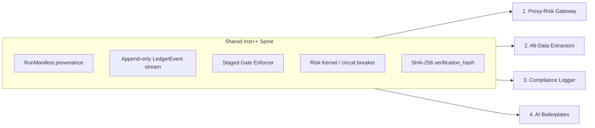

# Four New Products — Inst++ Grade Roadmaps

**Scope:** Brand-new B2B/B2C products — not extensions of Hibs Racing  
**Bar:** Institutional++ = does one job extremely well, with tamper-evident audit, staged enforcement, and operational kill switches  
**Source patterns:** Extracted from `hibs-racing` institutional layer + hibs-bet football analogs referenced in docs

---

## Strategic Frame

These four products share one architectural spine but serve different buyers:



**Design rule:** Each product is a **standalone package** with zero sports-domain imports. Racing/football code is the reference implementation, not the runtime dependency.

| Product | One job | Inst++ means | Price band |
|---------|---------|--------------|------------|
| **1. Proxy-Risk Gateway** | Stop bad automation before it hits live APIs | Sub-100ms kill + immutable intent log | £199–499/mo per instance |
| **2. Alt-Data Extractors** | Deliver one clean telemetry feed | ≥95% field coverage + ladder fallbacks | £500–2,000/mo per feed |
| **3. Compliance Logger** | Prove what the system decided and when | Auditor-verifiable data room in one export | License + maintenance retainer |
| **4. AI Boilerplates** | Ship AI apps without rate-limit/state bugs | Structured output + recovery baked in | £99–249 lifetime/seat |

---

## Universal Inst++ Checklist (all four products)

Every product must ship with these — ported from `institutional/check.py`, `ledger_events.py`, `run_manifest.py`:

| # | Capability | Racing reference | Generic requirement |
|---|------------|------------------|-------------------|
| 1 | **Run manifest** | `RunManifest` + `manifest_hash` | Every batch/job gets immutable identity (config + code version + inputs) |
| 2 | **Append-only ledger** | `ledger_events` | No UPDATE/DELETE on audit tables; compaction policy documented |
| 3 | **Verification hash** | `bet_verification_hash()` | SHA-256 over canonical fields per record |
| 4 | **Staged gates** | Gate1 → Gate2 → Production | Configurable pass/fail stages with `gate_reason` on every reject |
| 5 | **Circuit breaker** | `EXECUTION_DISABLED`, steam `abort` | Hard kill path independent of app logic |
| 6 | **Reconciliation** | `paper_reconciliation.py` | Expected vs actual row counts; blocking in production mode |
| 7 | **Rate limits** | `ingest/rate_limit.py` | Polite sleep + 429 retry; env overrides |
| 8 | **Observation mode** | `HIBS_OBSERVATION_LANE` | Soft checks for demo/burn-in without false alarms |
| 9 | **Health orchestrator** | `run_institutional_check()` | Single CLI/API pass/fail for ops |
| 10 | **Export data room** | `DATA_ROOM.md` + CSV | One-command auditor bundle |

---

## Product 1: Proxy-Risk Gateway

### One job

Sit between a company's automation scripts and live broker/payment APIs as an **air-gapped circuit breaker** — block runaway loops, price drift, and abnormal request velocity before capital moves.

### Why Inst++ (not just a reverse proxy)

A naive proxy forwards traffic. Inst++ **records intent, enforces policy, and kills independently** of the client process.

### Codebase mapping

| Extract from | Module | Port to |
|--------------|--------|---------|
| Staged gates | `cards/actionability.py` | `proxy_risk/gates/` — velocity, drift, stake caps |
| Risk kernel | `live/execution_router.py` + `execution_config.py` | `proxy_risk/kernel.py` — reject reasons, max_stake |
| Circuit breaker | `odds/market_steam.py` (`proceed`/`abort`) | `proxy_risk/breaker.py` — drift % + request burst |
| Intent contracts | `institutional/contracts.py` (`BetIntent`) | `proxy_risk/contracts.py` — generic `ApiIntent` |
| Shadow path | `institutional/shadow_execution.py` | `proxy_risk/shadow.py` — log-only mode before live |
| Execution log | `live/execution_log.py` | `proxy_risk/request_log.sqlite` — idempotency keys |

### Architecture

```
[Client Script] → [Proxy-Risk Gateway :8443] → [Broker/Payment API]
                         │
                         ├─ Gate1: auth + schema validate
                         ├─ Gate2: velocity + duplicate + stake caps
                         ├─ Gate3: price/reference drift check
                         ├─ Risk Kernel: APPROVE | REJECT | KILL
                         └─ ledger_events (append-only)
```

**Kill switch:** Gateway holds the API credential; client never sees the live key. `KILL=1` env or signed admin POST severs upstream instantly.

### Laser-focused roadmap

| Phase | Deliverable | Exit criteria |
|-------|-------------|---------------|
| **P0 — Shadow gateway** | Local Python package `proxy-risk` — intercept HTTP, log intents, forward unchanged | 1,000 requests logged; manifest per session; zero drops |
| **P1 — Gate enforcer** | Velocity cap (N req/min), duplicate idempotency, JSON schema validation | Integration test: loop script blocked at 10th identical POST |
| **P2 — Drift breaker** | Reference price/total checker — reject if >X% drift vs last good quote | Drift test: 5% move triggers `abort`; ledger event written |
| **P3 — Credential vault** | Gateway holds secrets; client uses short-lived proxy tokens | Client compromise does not expose broker API key |
| **P4 — Inst++ cert** | `proxy-risk check` CLI — manifest coverage, recon, breaker self-test | 7-day burn-in green; export data room for one tenant |

### What NOT to build

- No trading strategy logic
- No portfolio analytics UI
- No multi-tenant SaaS until P4 — start **single-tenant per server instance** (£199–499/mo maps to one Docker container)

### Monetization fit

**B2B monthly SaaS per instance** — sell on "minutes of capital saved" not features. Target: prop shops, e-commerce payment automation, crypto bot operators.

---

## Product 2: High-Velocity Alternative Data Extractors (DaaS)

### One job

Run **one headless scraper feed** continuously — airline fares, retail inventory, shipping delays — and deliver clean JSON via secured API. One product = one feed.

### Why Inst++

Funds pay for **coverage + freshness + provenance**, not raw HTML. Inst++ = field ladders, immutable snapshots, and coverage SLAs.

### Codebase mapping

| Extract from | Module | Port to |
|--------------|--------|---------|
| Provider ladders | `scrapers/multi_scraper_api.py` (`FIELD_LADDERS`) | `altdata/ladders.py` — per-metric source priority |
| Field resolver | `scrapers/field_resolver.py` | `altdata/resolver.py` — cascade until field filled |
| Dual-source merge | `cards/enrich.py` | `altdata/merge.py` — spine fields protected |
| Rate limits | `ingest/rate_limit.py` | `altdata/rate_limit.py` — polite_sleep + 429 |
| Snapshot store | `backtest/snapshot_store.py` | `altdata/snapshots.sqlite` — point-in-time rows |
| Telemetry balance | `institutional/telemetry_balance.py` | `altdata/sla.py` — fetch vs parse vs store timing |
| Recovery | `ingest/batch_enrich_recovery.py` | `altdata/recovery.py` — backfill sparse windows |

### Architecture

```
[Source A] ─┐
[Source B] ─┼→ [Extractor worker] → [snapshots.sqlite] → [GET /v1/feed/{metric}]
[Source C] ─┘         │                                        │
                      └─ RunManifest per poll                  └─ API key + rate limit
```

### Laser-focused roadmap

| Phase | Deliverable | Exit criteria |
|-------|-------------|---------------|
| **P0 — One feed MVP** | Pick **one** target (e.g. single airline route basket OR one retail SKU list) | 7-day continuous poll; snapshots queryable |
| **P1 — Field ladder** | ≥2 sources per critical field; `?rescue=1` overflow path | Coverage ≥85% on primary fields (gate_audit pattern) |
| **P2 — SLA telemetry** | `altdata check` — poll latency, coverage %, source mix | p95 poll < configured window; Matchbook-style balance report |
| **P3 — Secured API** | API keys, per-client rate limits, JSON schema versioning | One design partner on £500/mo pilot |
| **P4 — Inst++ data room** | Daily export bundle: snapshots + manifest + coverage audit CSV | Buyer DD passes without manual explanation |

### Feed selection (laser focus — pick ONE first)

| Feed | Complexity | Buyer | Notes |
|------|------------|-------|-------|
| Airline route fares | Medium | Quant travel/arbitrage desks | High velocity, public pages |
| Retail inventory drops | Medium | Consumer funds | SKU watchlists |
| Container/port delays | High | Logistics macro | Slower cadence, higher ticket |

**Do not** launch with multiple feeds. Inst++ = one feed at ≥95% coverage before adding a second SKU.

### Monetization fit

**Premium B2B API** — £500–2,000/mo per feed per client. No freemium; sell exclusivity windows (e.g. 15-min delay tier vs real-time tier).

---

## Product 3: "Un-Gameable" Compliance & Audit Trail Logger

### One job

Accept business events (decisions, approvals, automated actions) and produce **cryptographically sealed, timeline-accurate audit trails** that satisfy institutional auditors (DORA, UK financial frameworks, internal SOC2).

### Why Inst++

Spreadsheets and generic logs are gameable. Inst++ = append-only + hash chain + evidence gates + one-click data room.

### Codebase mapping

| Extract from | Module | Port to |
|--------------|--------|---------|
| Verification hash | `place/paper_ledger.py` | `compliance_log/hash.py` — canonical field order |
| Ledger events | `institutional/ledger_events.py` | `compliance_log/events.py` — generic event types |
| Run manifest | `institutional/run_manifest.py` | `compliance_log/manifest.py` — decision batch provenance |
| Evidence gates | `institutional/check.py` (10-point) | `compliance_log/gates/` — F1–F9 style checklist |
| Gate coverage audit | `analytics/gate_audit.py` | `compliance_log/evidence.py` — density per gate |
| Public verifier | `place/public_tracker.py` | `compliance_log/verifier.py` — `/verify?event_id=` |
| Retention | `institutional/log_retention.py` | `compliance_log/retention.py` — audit tables only |
| Data room export | `DATA_ROOM.md` patterns | `scripts/export_audit_room.sh` |

### Generic F1–F9 evidence gates (port from institutional checklist)

| Gate | Name | Pass condition |
|------|------|----------------|
| F1 | Snapshot completeness | 100% of decision windows have stored input snapshot |
| F2 | Manifest linkage | Every event references a `manifest_id` |
| F3 | Hash integrity | `verify_chain()` returns clean on sample |
| F4 | Timeline monotonicity | `created_at` ordering preserved; no backdated inserts |
| F5 | Config drift | `config_hash` stable or re-snapshot documented |
| F6 | Reconciliation | Expected decision count == logged count |
| F7 | Source coverage | Required input fields ≥85% populated |
| F8 | Retention policy | Compaction only on policy schedule; audit trail preserved |
| F9 | Export reproducibility | `export_audit_room.sh` regenerates identical bundle hash |

### Architecture

```
[App / Cron / Human] → [compliance_log ingest API]
                              │
                              ├─ snapshot input payload (immutable)
                              ├─ RunManifest (who/when/what version)
                              ├─ LedgerEvent + verification_hash
                              └─ F1–F9 evidence gates (scheduled)
                                        │
                                        └─ export_audit_room.sh → ZIP for auditors
```

### Laser-focused roadmap

| Phase | Deliverable | Exit criteria |
|-------|-------------|---------------|
| **P0 — Core logger** | Python SDK: `log_decision(snapshot, outcome, actor)` → SQLite | 10k events; hash chain verifies |
| **P1 — Evidence gates** | `compliance-log check` runs F1–F9 | All gates pass on synthetic 30-day dataset |
| **P2 — Export data room** | `export_audit_room.sh` — CSV + manifest + gate report + README | External auditor replay without vendor call |
| **P3 — Enterprise hooks** | SIEM webhook (Splunk/Datadog), optional HSM signing | One design partner signs maintenance retainer |
| **P4 — Inst++ cert** | SOC2-friendly docs: retention, access control, immutability proof | Passes buyer security questionnaire template |

### What NOT to build

- No general-purpose logging (leave that to Datadog)
- No ML / decision engine — **log decisions made elsewhere**
- No cloud multi-tenant until P3 — ship **on-prem Docker** first (regulated buyers prefer it)

### Monetization fit

**License + maintenance retainer** — one-time core (£5k–15k) + £500–1,500/mo for gate updates, retention, and audit support.

---

## Product 4: Micro-SaaS AI Integration Boilerplates

### One job

Give indie developers a **production-ready Python framework** for the hardest AI app problems: multi-source context injection, rate-limit buffers, structured output validation, and local failure recovery.

### Why Inst++

90% of AI apps fail on ops, not prompts. Inst++ = state loops that survive API 429s, mid-stream token drops, and invalid JSON — with the same manifest/ledger discipline as the other products.

### Codebase mapping

| Extract from | Module | Port to |
|--------------|--------|---------|
| Rate limits | `ingest/rate_limit.py` | `ai_kit/rate_limit.py` — token bucket + provider backoff |
| Pipeline isolation | `cards/refresh.py` + observation lane | `ai_kit/pipeline.py` — staged run with soft-fail mode |
| Calibrated output | `models/lgbm_ranker.py` (LambdaRank) + hibs-bet Laplace docs | `ai_kit/calibrate.py` — structured output scoring |
| Manifest per run | `institutional/run_manifest.py` | `ai_kit/manifest.py` — prompt hash + model version |
| Structured logging | `ledger_events` pattern | `ai_kit/trace_log.py` — per-call append-only trace |
| Multi-source context | `scrapers/field_resolver.py` + `enrich.py` | `ai_kit/context.py` — RAG source ladder |
| Gate validation | `cards/actionability.py` (reject with reason) | `ai_kit/validate.py` — schema gate on LLM output |

### Architecture

```
[User App] → [ai_kit AgentLoop]
                  │
                  ├─ context ladder (vector DB → file → web)
                  ├─ rate_limit buffer (per provider)
                  ├─ structured output gate (JSON schema / Pydantic)
                  ├─ recovery (retry partial, resume state)
                  └─ trace_log.sqlite (manifest + hashes)
```

### Laser-focused roadmap

| Phase | Deliverable | Exit criteria |
|-------|-------------|---------------|
| **P0 — Rate-limit kit** | `ai_kit.limits` — OpenAI/Anthropic backoff, 429 handling, env config | Survives 100 forced 429s without crash |
| **P1 — Structured output gate** | Pydantic validator + auto-retry on schema fail (max N) | 95% valid JSON on messy prompts in test suite |
| **P2 — Agent state loop** | Checkpoint file/SQLite; resume after kill -9 | Mid-run interrupt resumes from last good step |
| **P3 — Context ladder** | Multi-source inject with priority + fallback | 3-source context demo (local files + API + cache) |
| **P4 — Boilerplate repo** | `cookiecutter` template + Gumroad/GitBook docs | 10 beta buyers; NPS on "hours saved" |

### What NOT to build

- No hosted LLM proxy (avoid competing with OpenRouter)
- No no-code UI — **code-first** for developers
- No agent marketplace — single repo, single job: **reliable AI plumbing**

### Monetization fit

**B2C developer sales** — £99–249 lifetime/seat on Gumroad. Upsell: Inst++ tier (£49 extra) with compliance_log integration for teams needing audit trails.

---

## Build Order (portfolio of four)

Execute sequentially — each product funds and hardens the shared spine:

```
1. Compliance Logger (P0–P2)
   └─ Establishes hash chain + export_audit_room — reused by all others

2. Proxy-Risk Gateway (P0–P2)
   └─ Hardest revenue proof; uses compliance_log for intent audit

3. Alt-Data Extractor (P0–P1, ONE feed)
   └─ Reuses rate_limit + snapshot_store + gate_audit patterns

4. AI Boilerplates (P0–P2)
   └─ Packages rate_limit + manifest + validate for B2C scale
```

**Rationale:** Compliance Logger is the fastest path to a sellable Inst++ artifact (export bundle auditors understand). Proxy-Risk has the highest B2B ARPU. Alt-Data and AI kits scale once the spine is proven.

---

## Shared Package Structure (target monorepo)

```
inst-spine/                    # Shared Inst++ primitives (extract first)
├── contracts.py               # RunManifest, LedgerEvent, ApiIntent
├── ledger.py                  # Append-only SQLite
├── hash.py                    # verification_hash
├── gates/
│   ├── base.py                # staged gate protocol
│   └── registry.py
├── check.py                   # run_institutional_check generic
└── export_audit_room.sh

proxy-risk/                    # Product 1
altdata/                       # Product 2
compliance-log/                # Product 3
ai-kit/                        # Product 4
```

**Rule:** `inst-spine` has zero domain imports. Sports code never imports products; products import `inst-spine` only.

---

## Risk Matrix

| Risk | Product | Mitigation |
|------|---------|------------|
| Scope creep into full trading platform | Proxy-Risk | Hard cap: middleware only, no alpha |
| Legal/scrape ToS | Alt-Data | One feed; legal review per source; robots.txt respect |
| "Just use Splunk" objection | Compliance | Position as **decision-grade** tamper-proof, not logs |
| Boilerplate commoditization | AI Kit | Inst++ tier with audit integration; stay Python-native |
| Building all four at once | All | **One product to P2 before starting next** |

---

## Success Metrics (Inst++ promotion per product)

| Product | Inst++ promoted when |
|---------|---------------------|
| Proxy-Risk | 1 paying tenant; loop-kill demo on video; 30-day ledger with zero gaps |
| Alt-Data | 1 feed ≥95% coverage 30 days; 1 API subscriber |
| Compliance | `export_audit_room` passes external auditor dry-run |
| AI Kit | 50 paid seats; checkpoint recovery demo in docs |

---

## Commands (target — not yet implemented)

```bash
# Shared spine
inst-spine check --days 30
inst-spine export-audit-room --output ./audit_bundle.zip

# Product 1
proxy-risk serve --shadow          # log-only
proxy-risk check --kill-test

# Product 2
altdata poll --feed airline_uk_20
altdata check --coverage

# Product 3
compliance-log ingest --snapshot decision.json
compliance-log check --gates F1-F9

# Product 4
ai-kit run agent.yaml --checkpoint ./state.sqlite
```

---

## Related references in this repo

| Pattern | Path |
|---------|------|
| Institutional check | `src/hibs_racing/institutional/check.py` |
| Contracts | `src/hibs_racing/institutional/contracts.py` |
| Ledger events | `src/hibs_racing/institutional/ledger_events.py` |
| Gate enforcer | `src/hibs_racing/cards/actionability.py` |
| Execution router | `src/hibs_racing/live/execution_router.py` |
| Field ladders | `src/hibs_racing/scrapers/multi_scraper_api.py` |
| Rate limits | `src/hibs_racing/ingest/rate_limit.py` |
| Verification hash | `src/hibs_racing/place/paper_ledger.py` |
| Data room | `DATA_ROOM.md` |
| Portfolio Inst++ bar | `docs/PORTFOLIO_DEEP_DIVE.md` |
